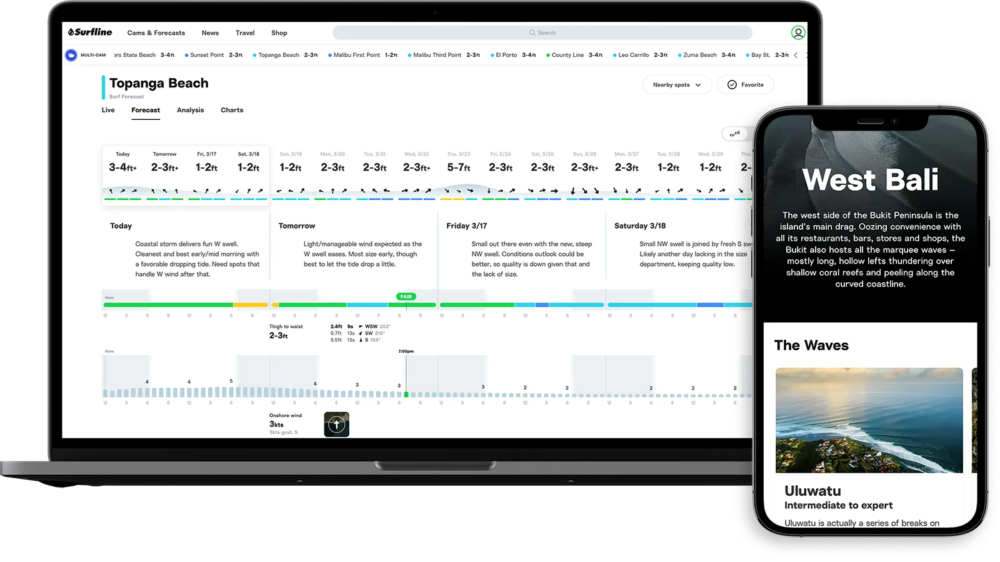

I started my VideoAmp journey in October of 2018. We moved to Los Angeles for my wife's job. I was originally working for REI when we moved, but quickly looked for a job on the Westside as isolation was taking its toll on me.

I started my VideoAmp journey in October of 2018. We moved to Los Angeles for my wife's job. I was originally working for REI when we moved, but quickly looked for a job on the Westside as isolation was taking its toll on me.
