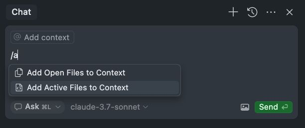

Here is a list of tools I've been using to assist me day to day with my various coding needs. I'll update this post over time as my journey continues down this assisted coding rabbit hole.

## GitHub

In GitHub I've lately been using Copilot for generating commit messages and pull request summaries. Both of these have been super helpful. I really like the generated commits when coding faster with an LLM, in particular in Agent mode.

I've also found the newly added ability to add Copilot as a reviewer on pull requests is super helpful. This comes in handy for me on project I may be the only engineer or when working with others across various timezones. I can kick off a Copilot review, or re-review before any of my coworkers are online to give their first look at the code.

## [Cursor](https://www.cursor.com)

_The AI Code Editor_ – from the Cursor website 

### Chat panel

I like that Agent and Chat mode have been combined to one view. I didn't quite understand why they needed to be different.

`/a` to "Add Open Files to Context"



At this point I rely primarily on Claude 3.7 Sonnet, and for more complex issues across a wider amount of the code base I may switch to 3.7 with thinking.

I find myself committing more frequently using an LLM. Any time I complete the next steps in a feature and it is in a working state I commit that portion of code and move onto the next set of prompts.

I've found it helpful to ask Cursor in Agent mode to check its own work by diffing the current branch against the main branch and recommending any improvements based on my rules file.

### [AI Rules](https://docs.cursor.com/context/rules-for-ai)

I recommend going through the basic steps of creating a rules markdown file. This can be done in virtually all IDEs supporting AI development with an LLM now. There is a collection of example rules you can browse at [cursor.directory](https://cursor.directory/rules). These are a good starting point for creating your own set of rules.

### [MCP](https://modelcontextprotocol.io/introduction) [Servers](https://github.com/modelcontextprotocol/servers)

MCP servers have proven to be super useful. I've been using [figma-context-mcp](https://github.com/GLips/Figma-Context-MCP) running inside Cursor by configuring the MCP config `.cursor/mcp.json`. You can see them actively running inside your Cursor settings.

```json
{
  "mcpServers": {
    "figma-developer-mcp": {
      "command": "npx",
      "args": ["-y", "figma-developer-mcp", "--stdio"],
      "env": {
        "FIGMA_API_KEY": "<your-figma-api-key>"
      }
    }
  }
}
```

The Figma MCP server specifically has allowed Cursor to speak directly to targeted areas of a Figma mock by right-clicking and using "Copy link to selection" or (cmd + L). The LLM then has direct understanding of the designs.

## [Visual Studio Code](https://code.visualstudio.com)

_Your code editor. Redefined with AI._  – from the VS Code website

### GitHub Copilot

I've been using the main extension but I turned on the nightly builds. "Switch to Pre-release Version"

#### VS Code Extensions

- [GitHub Copilot](https://marketplace.visualstudio.com/items?itemName=GitHub.copilot)
- [GitHub Copilot Chat](https://marketplace.visualstudio.com/items?itemName=GitHub.copilot-chat)

Been using o3-mini, claude 3.5 Sonnet and Gemini 2.0 Flash.

## [Warp](https://warp.dev)

_The intelligent terminal_ – from the Warp website

I've replaced my customized terminal via ohmyzsh with this standalone custom terminal app. I've been using it with zero customizations and am really happy overall. You can go in and out of agent mode seamlessly and things are styled quite nicely by default.

## [T3 Chat](https://t3.chat)

_T3 Chat is the best AI Chat ever made._ – from the T3 Chat website

I recently replaced my day to day questions with this fast AI Chat built by [theo](https://t3.gg) and team. I like it because it includes many of the current LLMs, not just [ChatGPT](https://chatgpt.com). It is also cheaper than what I was currently paying for ChatGPT Pro, $8 vs $20. This comes with less features and without a native app yet, but I'm very happy being able to access other LLMs.
