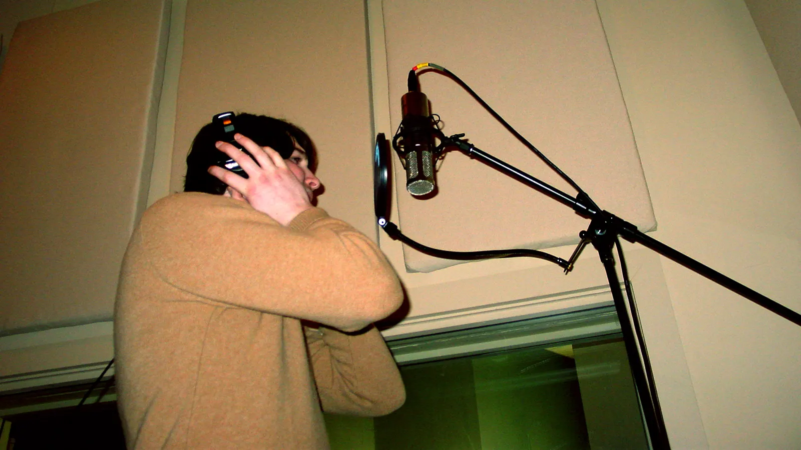
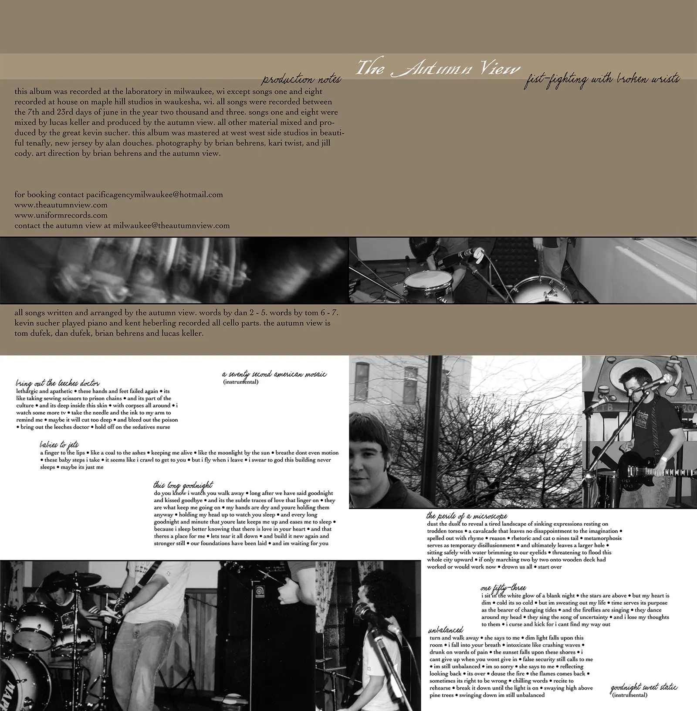
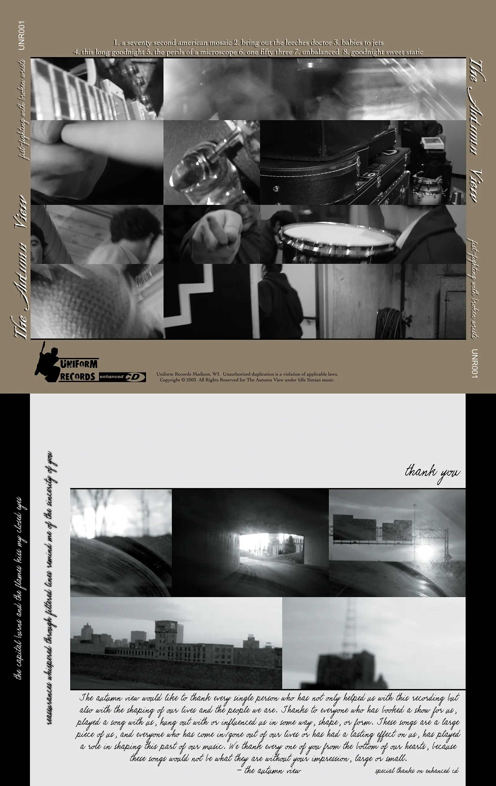
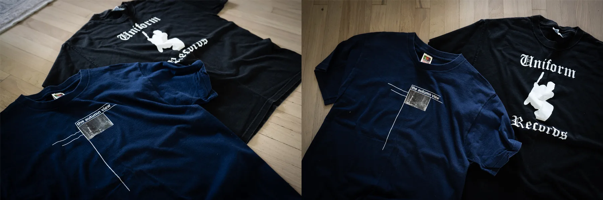
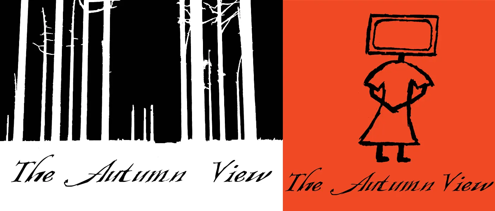
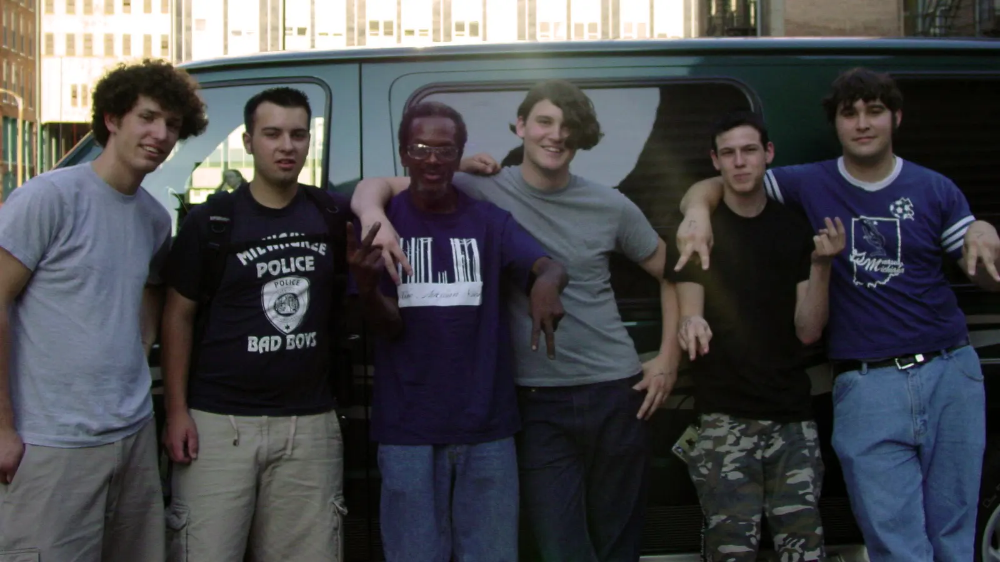

Throughout high school and college I played in a couple of bands. One of the bands was called (for the majority of the time) "The Autumn View". I started out playing guitar in the band in middle school when we were called "Westbound". We evolved over the years, as many adolescents do.

## "This Room Could Swallow Me" by The Autumn View

https://www.youtube.com/watch?v=8Cf3RWETlFM

This video is a collection of footage from our recording session in Chicago of our 2 song EP with [Matt Allison](<https://en.wikipedia.org/wiki/Matt_Allison_(record_producer)>) at [Atlas Studios](https://www.facebook.com/atlaschicago/).



In 2003 we released our first full-length record on our friend's label, Uniform Records. This release is titled "Fist-Fighting with Broken Wrists". Below is the album artwork for the CDs that went into production. I did the graphic design on the album.





## 2003 Sumer Tour

We started our tour at one of the local VFW halls known for shows. Hawthorne Heights actually opened the show for us; kicking of what I believe was one of their first tours on Victory Records.

https://www.youtube.com/watch?v=I64-BUpv-cM

This is footage from our CD Release show for the above album. This was the start of a tour we took to California and back.

### "If Only Household Solvents Could Solves This" by The Autumn View

https://www.youtube.com/watch?v=hBqQzS1oUvc

This video is a collection of footage from our 2003 tour and other random clips from around that time period. This was edited by Tom.

## Merch
Every year or so we'd have new t-shirts printed for shows. Here are 2 from both The Autumn View and Uniform Records:



These are 2 of many t-shirt designs we came up with over the years. The one on the left was, I believe, the most popular design. The "TV Girl" on the right was one of my favorites.



## Music

Here is a collection of music we released as "The Autumn View" for your listening pleasure.

### [The Autumn View - 2 Song Demo (2003)](https://soundcloud.com/brainbrian/sets/the-autumn-view-2-song-demo-2003)

Recorded in Chicago with [Matt Allison](<https://en.wikipedia.org/wiki/Matt_Allison_(record_producer)>) at [Atlas Studios](https://www.facebook.com/atlaschicago/)

<iframe width="100%" height="560" scrolling="no" frameborder="no" allow="autoplay" src="https://w.soundcloud.com/player/?url=https%3A//api.soundcloud.com/playlists/449394&color=%23ff5500&auto_play=false&hide_related=false&show_comments=true&show_user=true&show_reposts=false&show_teaser=true&visual=true" style="max-width: 640px; margin-bottom: 1rem;"></iframe>

#### Lyrics

_This Room Could Swallow Me_
```
I can’t slip far enough into this computer screen, 
a technological miscalculation of human error
where to turn when humans and machines have failed

[Chorus]
Rip the phone cord from the wall
drop the television from the window
[drop it, drop it out now]
Leave the pen 
Leave the paper
Goodnight

Let’s fast-forward this autobiography
Two months in the too near future
Replacement parts won’t do
Gripping these standard felt memories only kills time

I can’t slip far enough into this TV screen, 
This technological disaster
Where to turn

[Chorus]
Rip the phone cord from the wall
drop the television from the window
[drop it, drop it out now]
Leave the pen 
Leave the paper
Goodnight cruel world

I’ll be back when this mirror doesn’t spit in my eye 
when this vacant chest is filled
```

_If Only Household Solvents Could Solves This_
```
With the fluidity of a cement block I spell out these sleepwalking emotions
Traverse the catacombs to find a crackerjack message
Flail your wings and beat your desperate fins

[Chorus]
So stay where you lie
I’m the fish with the smooth back and underbelly
But slice me open and I’ll cut us both
And if household solvents could solve this now I might become an addict
I’m turning into
But an internal disease doesn’t require external medication

And this sinking ship
We still don’t need navigation
Our navigation’s love

[Chorus]
So stay where you lie
I’m the fish with the smooth back and underbelly
But slice me open and I’ll cut us both

And I’ll kindly cut us both 3x

So slice me open
I’ll spill my guts for you
And we will sit very still as you look in horror at the color of my blood
It’s black and filling your cupped hands
It’s black and filling your cupped hands
```

### [The Autumn View - Fist-Fighting With Broken Wrists (2003)](https://soundcloud.com/brainbrian/sets/fist-fighting-with-broken-wrists)

First and only full-length

<iframe width="100%" height="700" scrolling="no" frameborder="no" allow="autoplay" src="https://w.soundcloud.com/player/?url=https%3A//api.soundcloud.com/playlists/409954&color=%23ff5500&auto_play=false&hide_related=false&show_comments=true&show_user=true&show_reposts=false&show_teaser=true&visual=true" style="max-width: 640px; margin-bottom: 2rem;"></iframe>

### [The Autumn View - For All The Wrong Reasons... (1999)](https://soundcloud.com/brainbrian/sets/for-all-the-wrong-reasons)

Split EP with 52 Pick-Up

<iframe width="100%" height="700" scrolling="no" frameborder="no" allow="autoplay" src="https://w.soundcloud.com/player/?url=https%3A//api.soundcloud.com/playlists/410366&color=%23ff5500&auto_play=false&hide_related=false&show_comments=true&show_user=true&show_reposts=false&show_teaser=true&visual=true" style="max-width: 640px; margin-bottom: 2rem; display: block;"></iframe>



Out back of the of The Creepy Crawl in St. Louis 2023 with our friend who washed our van for a t-shirt.
