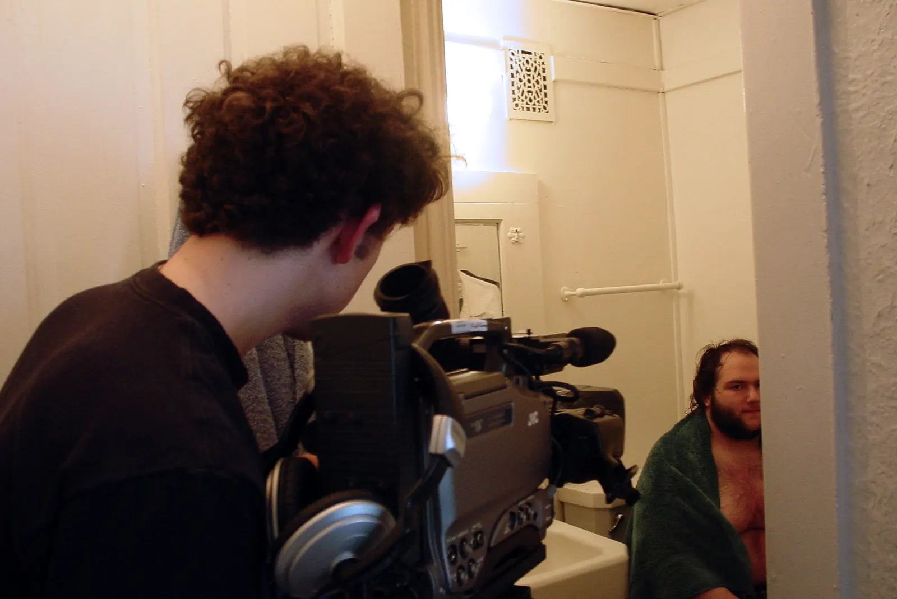
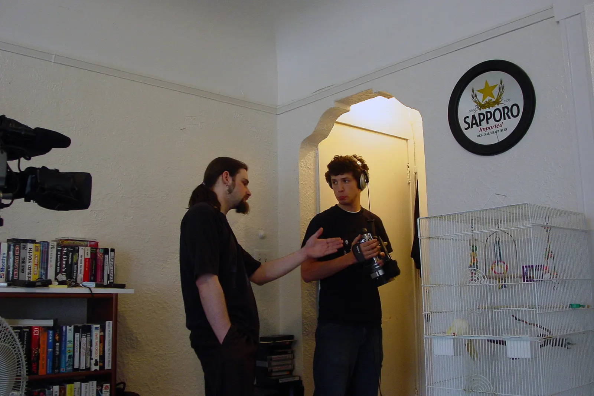

Let's Be Frank is a 30-minute short digital video that I produced, edited and co-directed for the Milwaukee Public Television Student Operations program.

https://www.youtube.com/watch?v=TuA2pA8EnPA

While in the Television and Video Production associates degree program at Milwaukee Area Technical College we were tasked with producing a 30 minute film/video project.

I (we) won best director award for the short film. The short film aired on Milwaukee Public Television.

