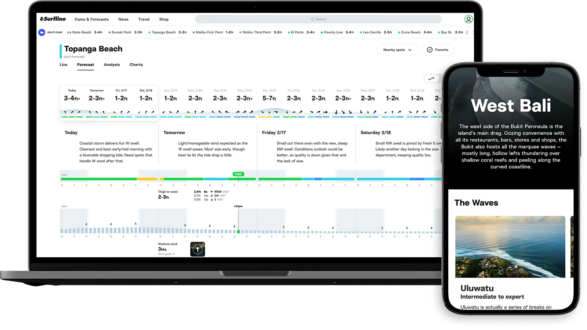

At Surfline, I started my journey on the Web Platform team, where I was responsible for overhauling our component system and migrating our frontend architecture to a more streamlined and efficient structure. Over the past two years, I've been part of a team that has significantly reduced the footprint of our frontend apps by migrating to Next.js and minimizing our use of microservices. We've also moved to a monorepo and implemented a more automated deployment system with tools like Cypress and GitHub Actions. My contributions have included research and driving change within these systems.

Recently, as our business goals have evolved, I've shifted my focus to feature delivery on our Know Before You Go forecasting products. As part of a larger engineering squad, I've led multiple technical initiatives and engineers in delivering numerous updates to these surf forecasting tools. I also lead frontend guild meetings and actively contribute to planning and documentation.

Below is a video of highlights from 2023 featuring many of the tools we build.

https://www.youtube.com/watch?v=uZFx4PpHc7E

I am committed to making surfing a better experience for everyone.

https://www.youtube.com/watch?v=il4OqsxHzso