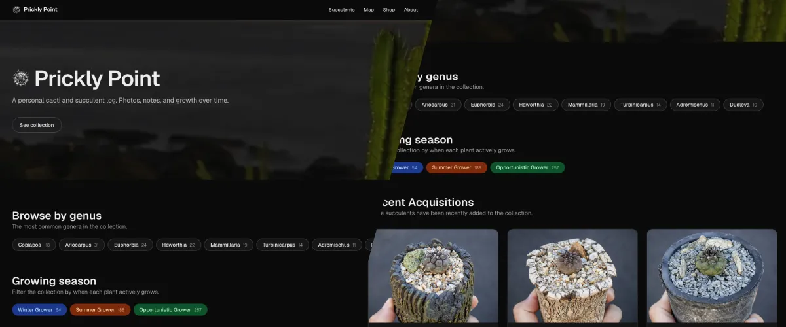
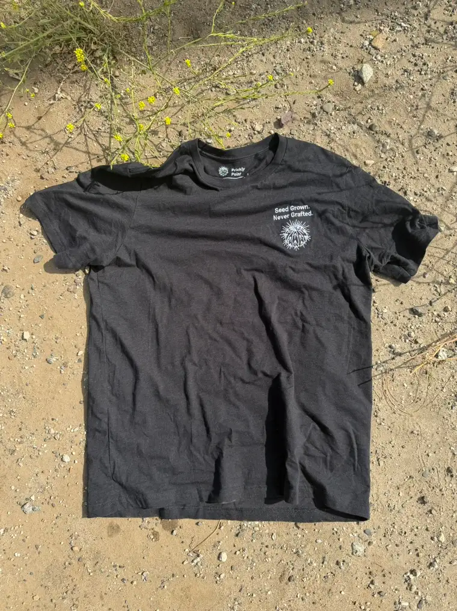

[Prickly Point](https://pricklypoint.com) is the personal log for my cacti and succulent collection. I launched it in January of 2026 and I am the only person behind it: I designed and built the site, I grow and collect the plants, and every photo on it is mine.

My interest in these plants started back in 2022 when the owner of Venice Plants gifted me a few starter succulents. Curiosity turned into an obsession fairly quickly. As I got deeper into drought-tolerant landscaping the collection grew in both directions: in-ground plantings around the yard and an ever-expanding shelf of potted succulents. I picked up a love of custom pottery along the way and now make my own cement pots from time to time. Prickly Point is based in Los Angeles, California, in [USDA hardiness zone 10b](https://planthardiness.ars.usda.gov/).

## Building the site

The collection outgrew what I could keep in my head, and a spreadsheet was not going to cut it. I wanted a real record of what I own, where it came from, and how it has changed. Prickly Point is built with Next.js and React using TypeScript and Tailwind CSS, with Supabase handling the Postgres database, authentication and photo storage. It is deployed on Vercel.

Each plant gets a record with full taxonomy — genus, species, and the affinis, subspecies, variety, cultivar and form qualifiers that actually matter when you are tracking a specific plant. Records also hold the vendor, potter, acquisition and sowing dates, whether the plant is variegated, and whether it is a winter, summer or opportunistic grower. The collection view lets me filter and search across all of it, which is genuinely useful when I am trying to remember whether I already own something before buying it again.

## Field numbers and habitat data

The part I am most happy with is the field number lookup. Many collected cacti carry a field number that identifies the original habitat collection, and I sync the [Cactus Field Number Database](https://rarecactus.com/field-numbers/) into Supabase with a script that rebuilds the table from its published CSV export. When a plant in my collection has a field number, its detail page automatically pulls in who collected it, the country and locality, the elevation and the collection date.

That data includes habitat coordinates, so the site also has a map view built with Leaflet on a satellite basemap with marker clustering. I deliberately keep the map coarse — it shows a general region for educational purposes rather than precise locations. Cactus poaching is a real problem, and I would rather the map be less impressive than be a treasure map for someone.

## Photos, tags and the greenhouse workflow

Every plant has a photo gallery I can reorder, so the images read as a growth timeline rather than a pile. Behind a Supabase-authenticated admin area I can add and edit plants and manage their photos from my phone while I am actually out among them.

I also put NFC tags in the pots. Each tag maps to a plant record, so tapping a pot with a phone opens that plant's page directly. It removes the worst part of tracking a collection, which is standing in the sun trying to work out which plant you are looking at.

## Shop

Prickly Point has a small shop page for the "Seed Grown. Never Grafted." embroidered t-shirt, alongside a rotating selection of plants I sell through Palmstreet.

The site also collects the reference material I lean on — field number databases, taxonomy indexes, societies and seed sources — plus my current potting mix and the tools I actually use. You can follow the collection on [Instagram](https://www.instagram.com/pricklypointsucculents) or find me on [Palmstreet](https://palmstreet.app/u/pricklypoint).
